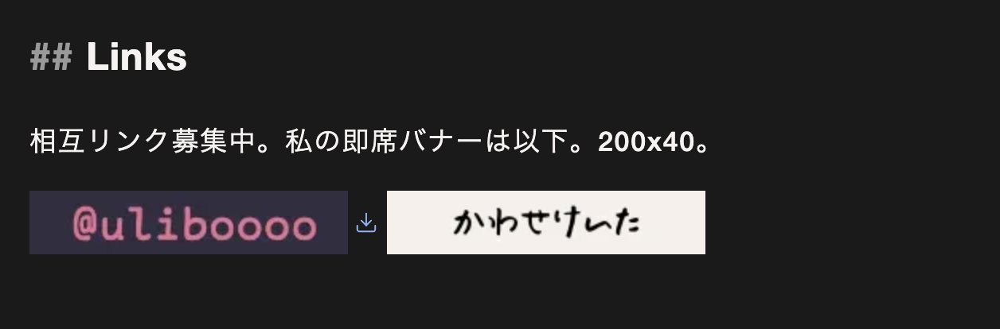

## Uliboooo Blog

Astro, Cloudflare Pages.

## ビルド機能・記法

markdownパイプラインは`src/markdown-pipeline.js`に集約されていて、サイト本体のレンダリングと`/html/<slug>`エンドポイントで共有される。

### Typst風記法(remark-typst)

`*strong*` / `_emphasis_` / `#footnote[内容]` / 行頭`=`見出し(`=`がh2)。詳細は[writeing_rule.md](./writeing_rule.md)を参照。

### ディレクティブ(remark-directive)

| 記法 | 出力 |
| --- | --- |
| `:::message` | 黄色の注意ボックス |
| `:::alert` | 赤色の警告ボックス |
| `:::details[ラベル]` | 折りたたみ(`<details>`/`<summary>`) |
| `:::image-row` | 画像の横並び(下記) |
| `:::pros` / `:::cons` | `+` / `−` 付きリスト |
| その他任意の名前 | その名前がclassになった`<div>`(インラインは`<span>`) |

`:::image-row`内の画像は1枚なら原寸(コンテナ幅まで)、2枚なら半分ずつ、3枚以上は高さを揃えて横スクロール。

### pros / consリスト

- `- :+ 項目` / `- :- 項目` → 通常リスト内に`+` / `−`項目を混在できる
- `+ 項目`で始まる箇条書きはリスト全体がprosになる

### コードブロックタイトル(remark-code-title)

言語名の後に`:`を付けてタイトルを書くとコードブロック上部に表示される。

````markdown
```rust: main.rs
fn main() {}
```
````

各コードブロックにはクライアントサイドでCopyボタンが付く。

### 画像(altサフィックス)

altテキストに`#xxx`を含めるとサイズ・挙動を制御できる。

| サフィックス | 効果 |
| --- | --- |
| `#auto` | 原寸(width: auto) |
| `#small` | 200px |
| `#medium` | 48% |
| `#middle` | 50% |
| `#upper` | 80% |
| `#no-lightbox` | クリック拡大(ライトボックス)の対象外にする |
| `#no-deco` | リンク画像の下線・外部リンクアイコンを消す |
| `#download` | リンクにダウンロードアイコンを付ける |

記事内の画像はクリックでライトボックス表示(`h`/`l`・矢印キーで前後、`Esc`で閉じる)。

### その他

- 記事中の行に裸のツイートURL(`https://x.com/.../status/...`)を置くと埋め込みに変換
- 外部リンクは自動で`target="_blank"` + 外部リンク装飾
- 脚注の戻りリンク`↩`はSVGアイコンに置換(iOSの絵文字化対策)
- 各記事はraw表示エンドポイントあり: `/md/<slug>`(markdown)、`/html/<slug>`(HTML)
- OG画像はsatoriでビルド時に自動生成(`/og/<slug>.png`)

### 記事の作成

```sh
./new  # bun製の対話スクリプト。タイトル等を入力するとsrc/content/にひな形を生成
```

frontmatterスキーマ(`src/content.config.ts`): `title`, `date`, `published`(必須) / `latest_edit_at`, `description`, `tags`(任意)。

## 相互リンク

募集中です。以下に例。200x40px

[](https://blog.uliboooo.dev/about_me/#links)

