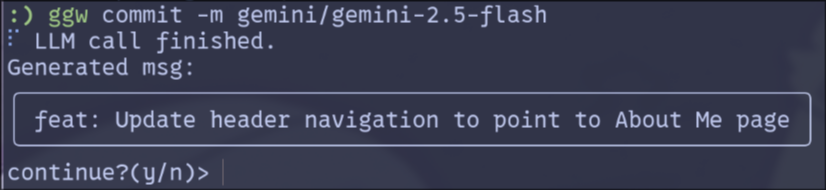
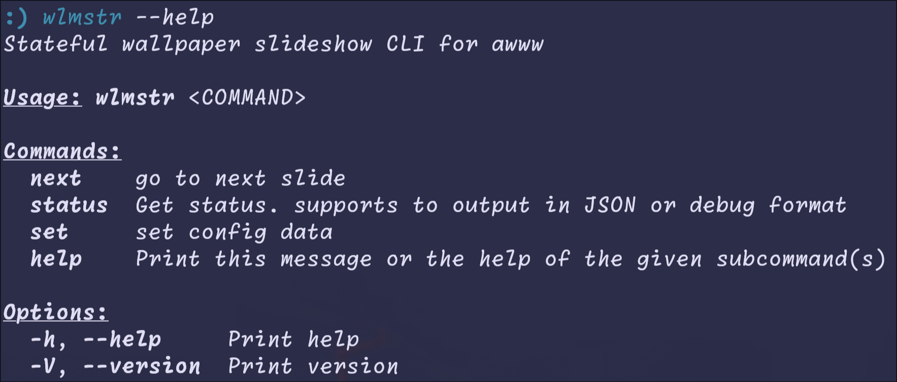
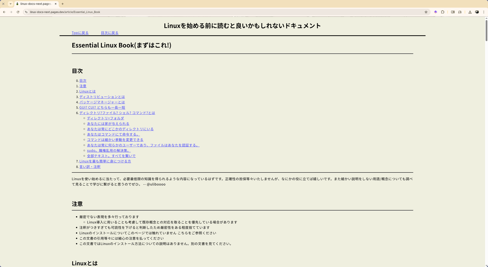
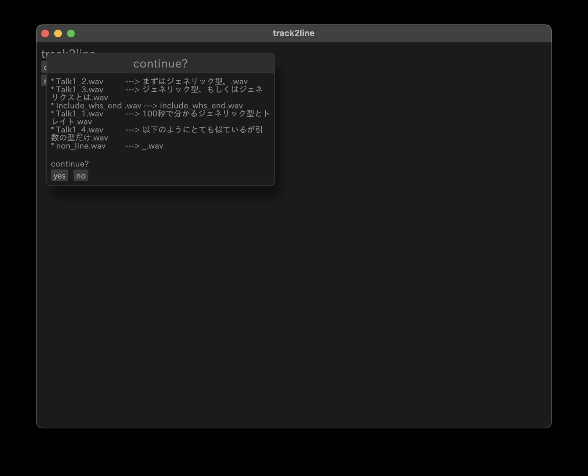
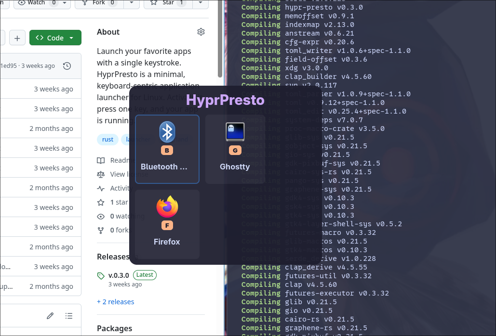
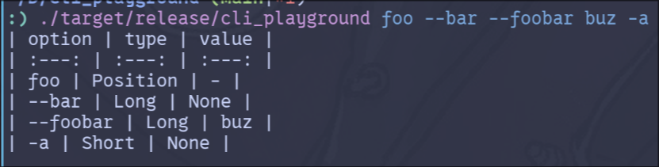
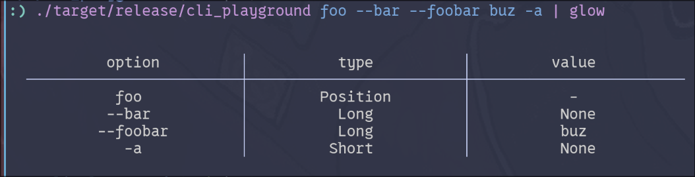
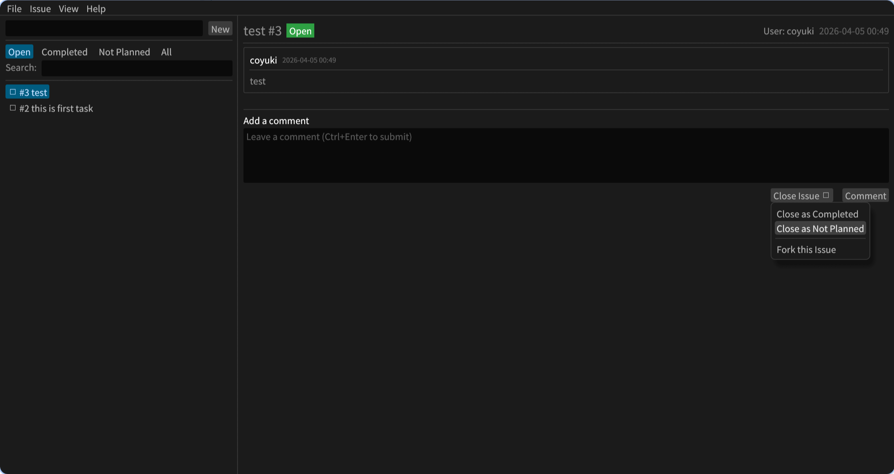
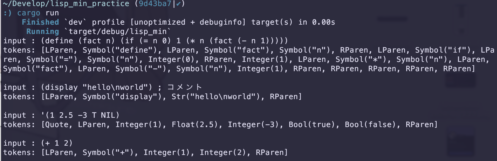

## [@Uliboooo](https://github.com/Uliboooo)

[瀬梨(Seli)についてはこちら](https://blog.uliboooo.dev/seli-ni-tsuite)


ソフトウェアと文字が好きな大学生。oは4つです。RustでCLIツールなどを開発しています。

I am a university student who loves Software and Text. My name has four 'o'. I develop CLI tools mainly using Rust.


> 好きな物:
> 文字, パスタ, かわいいもの, 軽さ, 雨, 睡眠, Vim, 紙袋, 鈴

> 嫌いなもの:
> 右クリック, 細かいUI, 多機能, 複雑な料金プラン

## SNS

[GitHub](https://github.com/Uliboooo), [X](https://x.com/Uliboooo), [マシュマロ](https://marshmallow-qa.com/db8xew1t5oa5l19?t=CH4dwd&utm_medium=url_text&utm_source=promotion), [Bsky](https://bsky.app/profile/uliboooo.bsky.social), [Instagram](https://instagram.com/uliboooo), [Zenn](https://zenn.dev/uliboooo), [note](https://note.com/uliboooo), [CodeBerg](https://codeberg.org/seli_am2)

## Links

相互リンク募集中。私の即席バナーは以下。（200x40）
<span style="
font-family: 'Monaspace Radon', 'Annotation Mono', monospace;
letter-spacing: 0.01em;
">[seli.am2@proton.me](mailto:seli.am2@proton.me?subject=%E7%9B%B8%E4%BA%92%E3%83%AA%E3%83%B3%E3%82%AF%E3%81%AB%E3%81%A4%E3%81%84%E3%81%A6)</span>
へご連絡ください。

[](https://raw.githubusercontent.com/Uliboooo/blog/main/src/content/about_me/banners/uliboooo.webp)
[](https://keitagame.github.io/)

## Works

### ghost_git_writer

LLMでGitコミットメッセージ、README、または差分要約を作成するツール。本当はサブコマンドではなく別コマンドとして実装するべきだったためいつか分けることを検討中...

[Github Repository](https://github.com/Uliboooo/ghost_git_writer)



### dotfiles

Hyprland + Archを中心としたdotfiles。個人用ですが、ある程度汎用化してあるため流用可能。含まれる設定などはREADMEを参照ください。

[GitHub Repository](https://github.com/Uliboooo/dotfiles)


### wlmstr

awww を利用した stateful な壁紙管理 CLI ツールです。指定したディレクトリ内の画像を順番に管理し、実行するたびに壁紙を切り替えます。スライドモードとして、順方向、逆方向、ランダムをサポートしています。Rust製。

[GitHub Repository](https://github.com/Uliboooo/wlmstr)



### 初心者向けLinux doc


大学のLinuxサークル(申請中)のメンバー([@liar2357](https://github.com/liar235)と[@Uliboooo(me)](https://github.com/Uliboooo))と共同でリリースを行ったサイトです。Linuxを始めるにあたっての基礎的な学習を行う事を目的としたサイトです。

私は主に文書を、[@liar2357](https://github.com/liar2357)はサイト(React等)のシステムを構築しました。

[GitHub Repository](https://github.com/linux-club-tid/linux-docs-next), [Website](https://linux-docs-next.pages.dev/)



### easy_storage

Rustにおけるstructやenumデータを、JSONまたはTOML形式で容易にファイルへ保存、読み込みするためのTraitを提供するライブラリ。実質的にはserdeのラッパー。

[GitHub Repository](https://github.com/Uliboooo/easy_storage), [crates.io](https://crates.io/crates/easy_storage)

```rust: usage
use serde::{Deserialize, Serialize};
use easy_storage::Storeable;

#[derive(Debug, Serialize, Deserialize)]
struct User {
    name: String,
    email: String,
}

impl Storeable for User {}
```

### track2line

VoiSona Talk などから出力された音声ファイルの名前を、台詞テキストを参照して一括変換するツール。メイン機能はLibとして分離されており、CLIとGUI版を開発している。GUIは[egui](https://github.com/emilk/egui)で実装。

[GitHub Repository [CLI]](https://github.com/Uliboooo/track2line)
[GUI](https://github.com/Uliboooo/track2line_gui)
[Lib](https://github.com/Uliboooo/track2line_lib)



### hypr-presto

GTK製のWayland向けアプリランチャー。アプリを1つのキーストロークで起動。例えば以下の場合にはhypr-presto起動後に`f`を押すだけでFirefoxが起動する。登録するアプリは設定ファイルで定義。prestoは演奏記号で[極めて速く](https://ja.wiktionary.org/wiki/presto)という意味から。

[Github Repository](https://github.com/Uliboooo/hypr-presto)



### cli_playground

CLIにおける引数などの一般的な、解析結果のみを表示するコマンドです。これは環境を壊さずにCLIを練習するためのものです。

[GitHub Repository](https://github.com/Uliboooo/cli_playground)




### voime

Linuxでwhisperを用いた音声入力をできるようにすることを目指すプロジェクト。元々はIMEとして開発する予定であったため、Voice + IMEとして`voime`としたが ~~IMEとしての実装が面倒になったため、~~ ポップアップで文字起こししてクリップボードにコピーする形に。

[GitHub Repository](https://github.com/Uliboooo/voime)

### local_issues_lib

GitHubのIssuesと似たような課題管理をローカルで行うための機能を提供するlib。下記の`fork_notes`にて使用。

[GitHub Repository](https://github.com/Uliboooo/local_issues_lib)

### fork_notes

上記の`local_issues_lib`をGUIとして実装したもの。GUIは`egui`を利用。

[GitHub Repository](https://github.com/Uliboooo/fork_notes)



### task_manage_practice_mbt

Moonbitの練習用。ソフトウェアの完成度よりMoonbitの使い方を勉強している途中。

[GitHub Repository](https://github.com/Uliboooo/task_manage_practice_mbt)

### Mother_is_angry

x.comへアクセスした際に[hacker news](https://news.ycombinator.com/)にリダイレクトするだけのChrome extenstion。名前に意味はないです。

[GitHub Repository](https://github.com/Uliboooo/Mother_is_angry)

### min_lisp

プログラミング練習のための最小限のLisp環境。開発中のためまだ全然未完成。

[Github Repository](https://github.com/Uliboooo/lisp_min_practice)



### blog

このサイト。About meもblogの記事の1つの扱いです。(一応about.uliboooo.devからリダイレクト)

[Github Repository](https://github.com/Uliboooo/blog)

Astroとcloudflare pagesで静的配信しています。外部リンクへの自動属性付与などいろいろ楽に書けるようにしてます。

## Capabilities

webは苦手ですが最近ちょっとだけ手を出しています。Astro大好き。

[Rust](https://github.com/Uliboooo?tab=repositories&q=&type=public&language=rust&sort=), [Shell](https://github.com/Uliboooo?tab=repositories&q=&type=public&language=shell&sort=), [CLI Development](https://github.com/Uliboooo?tab=repositories&q=cli&type=public&language=&sort=), [Lib Development](https://github.com/Uliboooo?tab=repositories&q=lib&type=public&language=&sort=)

