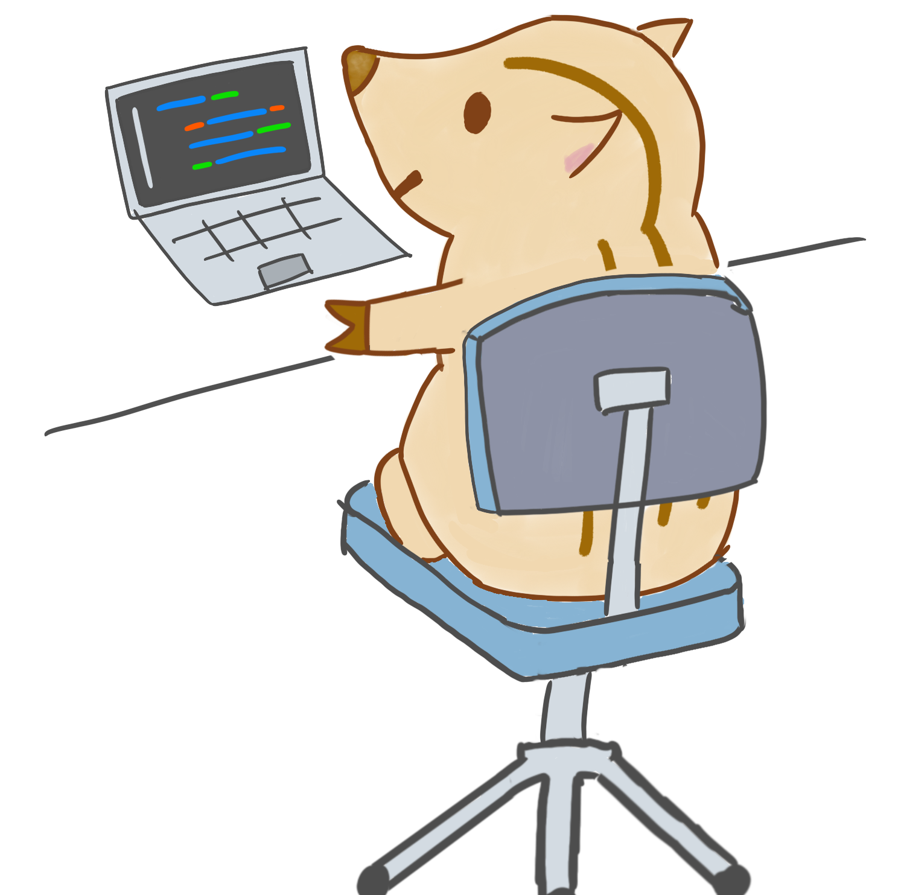
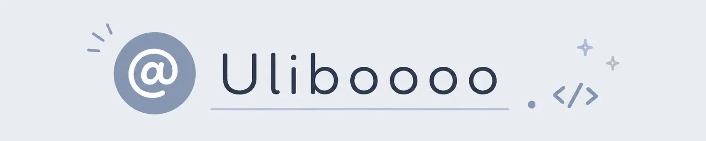
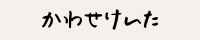

title: "About Me"
date: 2026-03-17
latest_edit_at: 2026-07-28
writer: "Uliboooo"
description: "Ulibooooについて"
tags: ["me"]
published: true
---

## [Uliboooo](https://github.com/Uliboooo)

<a href="../seli-ni-tsuite" class="link--underline link--external" target="_blank" rel="noopener noreferrer">瀬梨(Seli)についてはこちら</a>

(19) ソフトウェアと文字が好きな大学生。oは4つです。RustでCLIツールなどを書いてる。最近はGleamとか処理系にも興味ある。好きな記号は`|>`。ゲームは下手(AIMが必要だと特に壊滅的)。

(19) A college student who loves software and text. There are four o's. I write CLI tools and stuff in Rust. Lately I'm also into Gleam and language processor. Favorite symbol is `|>`. I suck at games (especially when you need AIM—it's a total disaster).

> 好きな物:
> 文字, パスタ, かわいいもの, 雨, 睡眠, 紙袋, 鈴, 硝子

> 嫌いなもの:
> 右クリック, 細かいUI, 多機能, 複雑な料金プラン

<a href="../works" class="link--underline link--external" target="_blank" rel="noopener noreferrer">Works(作ったものとか)</a>

## SNS

[GitHub](https://github.com/Uliboooo), [X](https://x.com/Uliboooo), [マシュマロ](https://marshmallow-qa.com/db8xew1t5oa5l19?t=CH4dwd&utm_medium=url_text&utm_source=promotion), [Bsky](https://bsky.app/profile/uliboooo.bsky.social), [Zenn](https://zenn.dev/uliboooo), [note](https://note.com/uliboooo), [CodeBerg](https://codeberg.org/seli_am2)

## Capabilities

大体RustとかFP系の言語でCLIとかLib書いてる。

[Rust](https://github.com/Uliboooo?tab=repositories&q=&type=public&language=rust&sort=), [Shell](https://github.com/Uliboooo?tab=repositories&q=&type=public&language=shell&sort=), [CLI Development](https://github.com/Uliboooo?tab=repositories&q=cli&type=public&language=&sort=), [Lib Development](https://github.com/Uliboooo?tab=repositories&q=lib&type=public&language=&sort=)

webは苦手ですが最近ちょっとだけ手を出しています。Astro大好き。

## Links

相互リンク募集中。私の即席バナーは以下。（200x40）
[seli.am2@proton.me](mailto:seli.am2@proton.me?subject=%E7%9B%B8%E4%BA%92%E3%83%AA%E3%83%B3%E3%82%AF%E3%81%AB%E3%81%A4%E3%81%84%E3%81%A6)
へご連絡ください。

