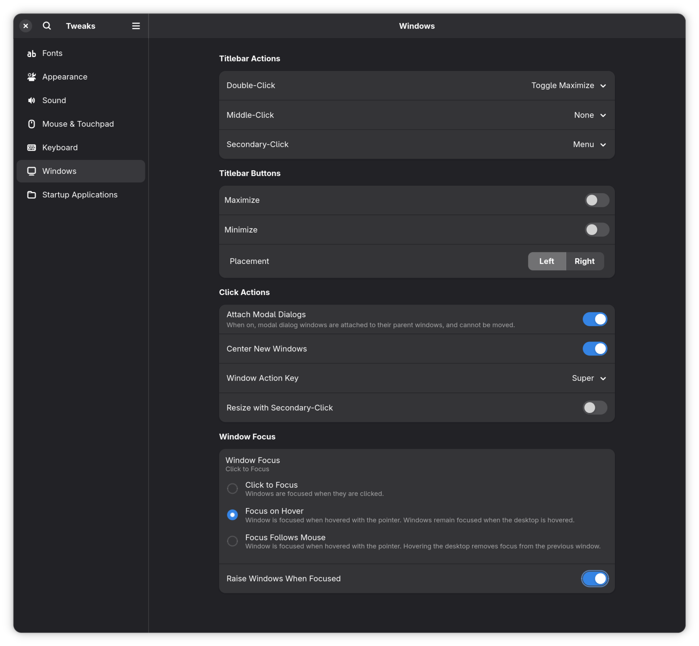

## use Settings app

turn on `Settings, Accessibility, Pointing and Clicking, Active Windows on Hover`.

## if you want to raise windows

turn on `Tweaks, Windows, Raise Windows When Focused(the bottom)`.

