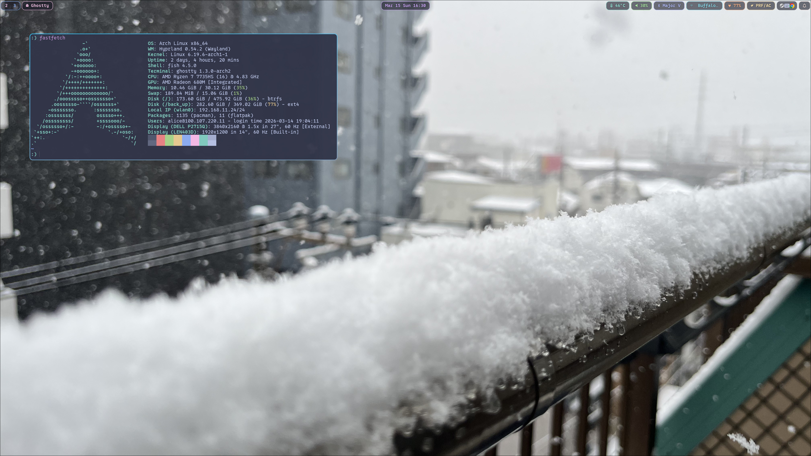

## @Uliboooo

ソフトウェアと文字が好きな大学生。oは4つです。RustでCLIツールなどを開発しています。Vim派。

I am a university student who loves Software and Letters. My name has four 'o'. I develop CLI tools mainly using Rust. I'm a Vimmer.

## Works

### ghost_git_writer

LLMでGitコミットメッセージ、README、または差分要約を作成するツール。

[Github Repository](https://github.com/Uliboooo/ghost_git_writer)

### dotfiles

Hyprland + Archを中心としたdotfiles。個人用ですが、ある程度汎用化してあるため流用可能です。

[GitHub Repository](https://github.com/Uliboooo/dotfiles)

### track2line

VoiSona Talk などから出力された音声ファイルの名前を、台詞テキストを参照して一括変換するツール。

[GitHub Repository](https://github.com/Uliboooo/track2line)

## Capabilities

[Rust](https://github.com/Uliboooo?tab=repositories&q=&type=public&language=rust&sort=), [shell](https://github.com/Uliboooo?tab=repositories&q=&type=public&language=shell&sort=)

## SNS

- [GitHub](https://github.com/Uliboooo)
- [X](https://x.com/Uliboooo)
- [Zenn](https://zenn.dev/uliboooo)
- [note](https://note.com/uliboooo)

