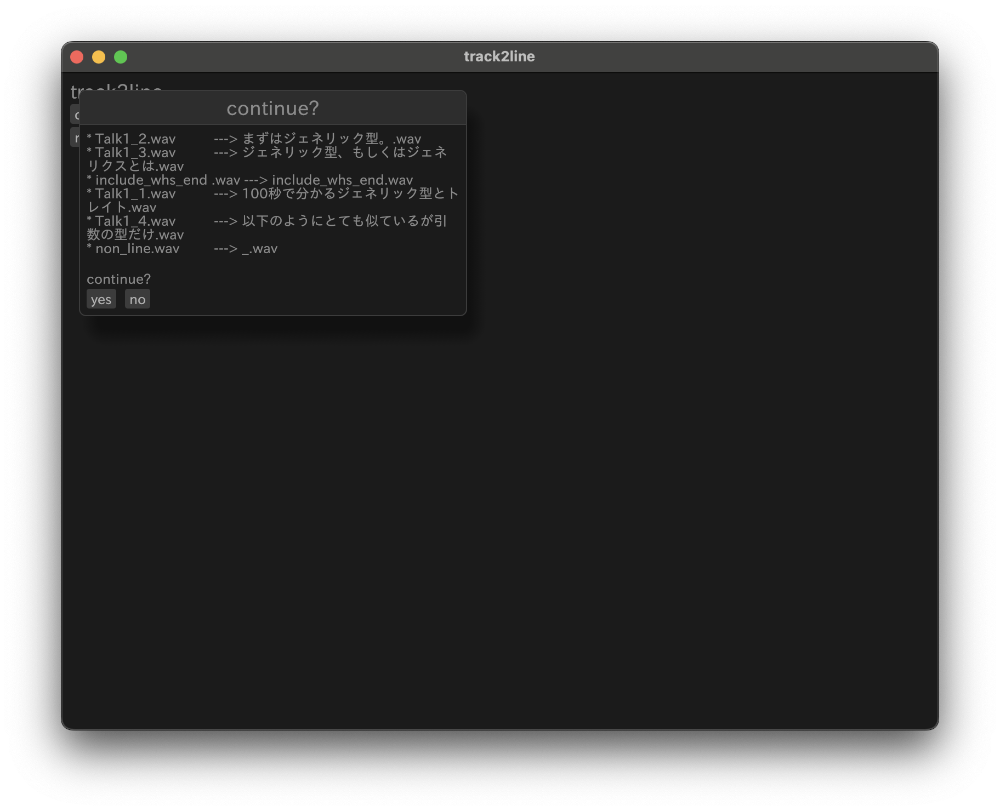

## [@Uliboooo](https://github.com/Uliboooo)

ソフトウェアと文字が好きな大学生。oは4つです。RustでCLIツールなどを開発しています。Vim派。

I am a university student who loves Software and Text. My name has four 'o'. I develop CLI tools mainly using Rust. I'm a Vimmer.

## Works

### ghost_git_writer

LLMでGitコミットメッセージ、README、または差分要約を作成するツール。

[Github Repository](https://github.com/Uliboooo/ghost_git_writer)

### dotfiles

Hyprland + Archを中心としたdotfiles。個人用ですが、ある程度汎用化してあるため流用可能です。

[GitHub Repository](https://github.com/Uliboooo/dotfiles)

### track2line

VoiSona Talk などから出力された音声ファイルの名前を、台詞テキストを参照して一括変換するツール。メイン機能はLibとして分離されており、CLIとGUI版を開発しています。GUIは[egui](https://github.com/emilk/egui)で実装されています。

[GitHub Repository [CLI]](https://github.com/Uliboooo/track2line)
[GUI](https://github.com/Uliboooo/track2line_gui)
[Lib](https://github.com/Uliboooo/track2line_lib)

## Capabilities

[Rust](https://github.com/Uliboooo?tab=repositories&q=&type=public&language=rust&sort=), [Shell](https://github.com/Uliboooo?tab=repositories&q=&type=public&language=shell&sort=), [CLI Development](https://github.com/Uliboooo?tab=repositories&q=cli&type=public&language=&sort=)

## SNS

- [GitHub](https://github.com/Uliboooo)
- [X](https://x.com/Uliboooo)
- [Zenn](https://zenn.dev/uliboooo)
- [note](https://note.com/uliboooo)

<blockquote class="twitter-tweet">
嫌いなもの: 右クリック, 微妙に使いずらいスクロールホイール, 細かいUI, 多機能, 上手いことまとまらない髪, 肉肉しい肉, 複雑な料金プラン
&mdash; Uliboooo (@Uliboooo) <a href="https://twitter.com/Uliboooo/status/2035978866943238175?ref_src=twsrc%5Etfw">March 23, 2026</a></blockquote> 

