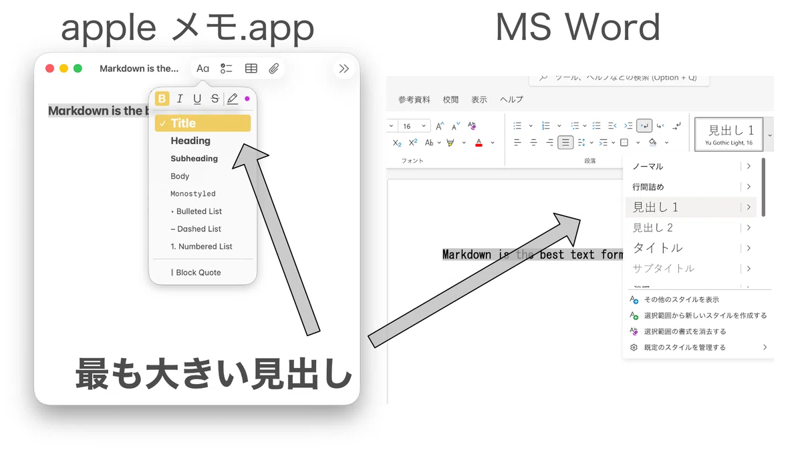
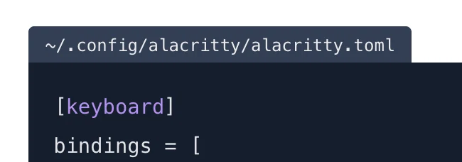

## Markdownとは

> Markdown（マークダウン）とは、プレーンテキスト形式で書式付きテキストを記述する軽量マークアップ言語である。

https://ja.wikipedia.org/wiki/Markdown

テキストによる表現においてメタ的な表現[^1]をしたいことがある。例えば太字による強意の表現、打ち消し線による取り消しの表現、見出しなどの構造を文章に与える、等。こういう表現は一般的にはWordやメモ帳のツールを使ってそのソフトウェアに依存した状態でメタ的な表現として与えることが多いでしょう。

しかし、これらの方法ではそのツールでテキストを開かなければ、そのメタ的な表現を認識することが出来ない(そもそも他ツールで開けないことも多い)というデメリットがあります。要は見る人の環境が整ってないと意味が失われてしまうのです。

また、SMSやX[^2]などのそもそもメタ表現がない環境においてもメタ的な表現をするためのツールが欲しいところです。

[^1]: 表記された単語や文法外の意味としてこの記事では使用している。
[^2]: 最近は課金ユーザーはmd記法が使えるとか何とか

## Markdownはただのテキスト

ここまででメタ表現の利用はツールなどの環境に依存し、共有性(ポータビリティ)が低いということがわかりました。これに対する解決策はシンプルで、依存しなければいいのです。ただのテキストでメタ表現するのです。

アプリのボタンではなく、そこに記されたテキストで表現するのです。例としては ** で囲った文字が太字になります。こうすることでどんな環境でも見ても" **で囲われた"という情報からメタ的な意味を汲み取るのは人になったため、環境へ依存がなくなりました。

またこういった表記の仕方をMarkdown記法などと表現します。

Markdown記法の入力例とプレビュー結果の比較図。見出し、太字、リスト、脚注などの基本構文がどのように表示されるかを左右に並べて解説している。

noteに表を埋め込む (Gist)

一応画像に主要な記法はありますが、より具体的な記法を。

|||
| :---: |:---: |
| `# 見出し` | #の数によって見出しが深くなる|
| `**太字**` | **強意** |
| `~~打ち消し~~` | ~~取り消し~~ |
| `_斜体_` | _斜め_ |
| `- リスト` | - リストの表現 |

以前の記事でも軽く触れいていますのでそちらもよければ。

## 読みにくい

実はMarkdown以外にもテキストでメタ表現する方法があり、その代表例がHTMLというものです。というかMarkdownの元がこれ。[^3]

しかし、HTMLは見出しを表現するのに、`<h1>見出し1</h1>`というように`<h1>`と`</h1>`というタグで囲う必要がありました。こんな表記は記述性の面でも可読性の意味でも弱いです。(コンピュータによる解釈としては厳密で便利ですが)

[^3]: 元はと言えばmarkdownはhtmlを簡単に記述するための省略記法的なやつだったはず。

そこでほとんどの環境ではMarkdownは先ほどの複雑な記号たちを隠し、シンプルな記法で同じような表現をするようにしました。これで少なくともHTMLよりは読みやすくなったはずです。

HTMLタグとMarkdown記法の書きやすさの比較

しかし、これでもちょっと怖い文章です。Markdownを知らなければ # って何だよっ、となってしまいます。

そこで、Markdownに対応するようなサイトでは、文字サイズの変更などで見た目的な表現にメタ表現を変換します。先ほどの画像でもあったようにWordなどでぽちぽちしたような感じで、見やすい表示になります。これを一種のレンダリングと言います。

見出しのサイズによって文字サイズ/太さが変わる

これでは環境に依存しているでは無いかと思う人も多いでしょう。そうです。もしこのレンダリング結果に依存するなら、それは環境に依存していると言えるでしょう。

また、Markdownは厳密なスタンダード(標準化)がなく、各方言が乱立している状況です。今回紹介したものもあくまで事実上のスタンダードであり、ほとんどのサービスが対応している、というだけです。

そのためレンダリングされるサービスだからと言って、全てのMarkdown記法が使えるとも限りません。

あるサービスAでは、プログラムのコード表記にファイル名的なものを付けられるが、Bでは対応してないみたいなこともあります。👇はnoteではできない。

現状、各サービスの対応具合はこんなところ? 厳密に言えば2,3つ目は包含の関係ではない。

- 何も対応してない。そのままテキストとして表示。
- 対応はしてる。レンダリングされてぱっと見でも読みやすい。
- 対応してるし。サービス独自の便利機能がある(Zenn, Qiitaなど)

## 別にレンダリングしてくなくても読めるのでは?

これがMarkdownの本質というか個人的に推す一番の理由です。

例えばXでここだ大事だよ的な強調の意味で単語を使う際に ** で囲んだ場合は、Markdownを理解していれば、たとえXが太字にレンダリングしてくれなくとも、この単語が重要であると理解できます。

Markdownは極めて容易な記法でメタ表現ができるというシンプルで強力な記法なのです。

先述の3の状態のいかなる場合においてもメタ的表現を行えるのです。「特定のツールに縛られず、書くことと読むことに集中できる」最強の記法であることを宣伝したかったので書いた記事でした。

## まとめ?

Markdownは

- どんな環境でも読める
- どんな環境でも書ける

みんな使えばこの記法が浸透していき標準的な書き方になれば幸いです?

