従来はGUIでやっていた作業をもっとTUIでやってみようという話です。役立ちそうなTUIたちを紹介します。

あと、[わたしのdotfiles](https://github.com/Uliboooo/dotfiles)にNixOSの設定まであるので、たぶんこれをまんまパクればそのまま記事中のTUIや設定は動くと思われます。(Nix初心者すぎて分からない)
ただかなり個人に寄せたHyprlandなどの設定なのでちょいちょい設定などをパクるくらいがいいかも。

## File Manager: Yazi

GUIではGNOMEのNautilusやKDEなどのDolphinがあります。でもマウスぽちぽちするのが面倒なこともあります。

[Github-yazi](https://github.com/sxyazi/yazi)

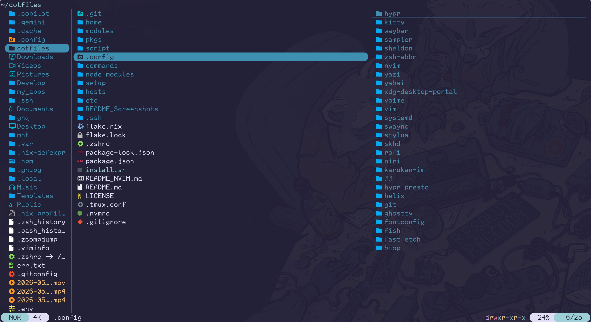

基本的な操作はvimな感じで`hjkl`でディレクトリ移動とファイル選択のカーソル移動ができる。
こういう時vimに慣れていると便利。

`y`でコピー、`p`でペースト、`x`でカットなどの基本操作もサポートされています。

またprefixキーを用いて特定のディレクトリへのジャンプなども対応しています(`g␣`)。

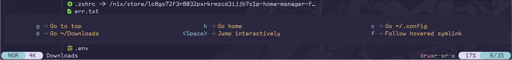

prefix後にヘルプが出るのも良い。

ターミナルが対応していれば画像などもプレビューできます。特定のツールがあればsvgやmp4などのプレビューも可能です。(mp4はサムネイルだけ)
svgは[resvg](https://github.com/linebender/resvg)など。詳しくは[Installation - Yazi](https://yazi-rs.github.io/docs/installation/)にて。あとプレビュー枠に必要なツールの名前が出ることもあります。

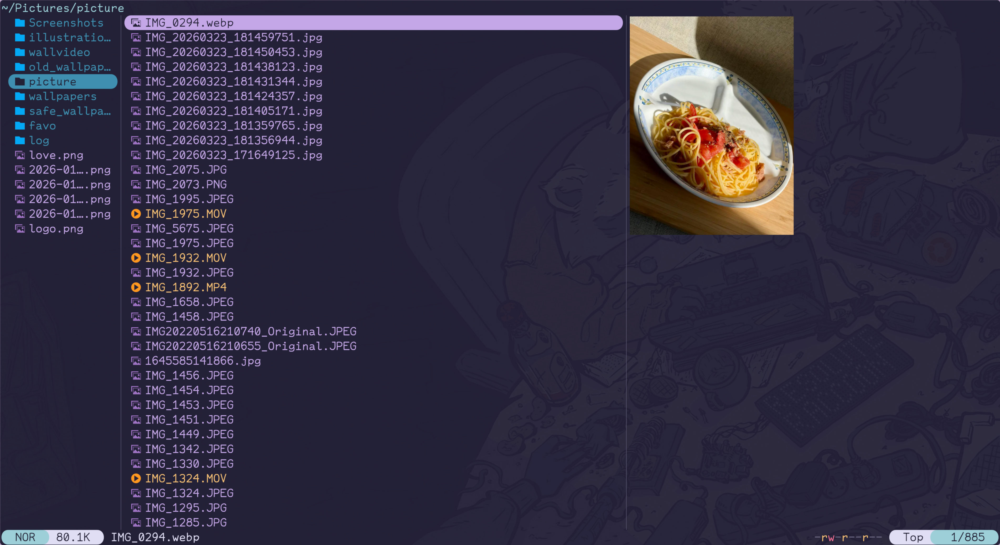

### 個人的に使ってるメイン機能

`␣`はスペースのこと。

| key | desc |
| :---: | :---: |
| `g␣` | パス入力ジャンプ |
| `gh` | homeへジャンプ |
| `␣` | 選択 |
| `y` | コピー |
| `p` | ペースト |
| `x` | カット |
| `r` | 名前変更 |
| `z` | fuzzy検索 |
| `t` | タブ作成 |
| `[` | 左のタブへ |
| `]` | 右のタブへ |
| `tab` | 情報 |

tabキーでファイル/ディレクトリの情報も見れる。

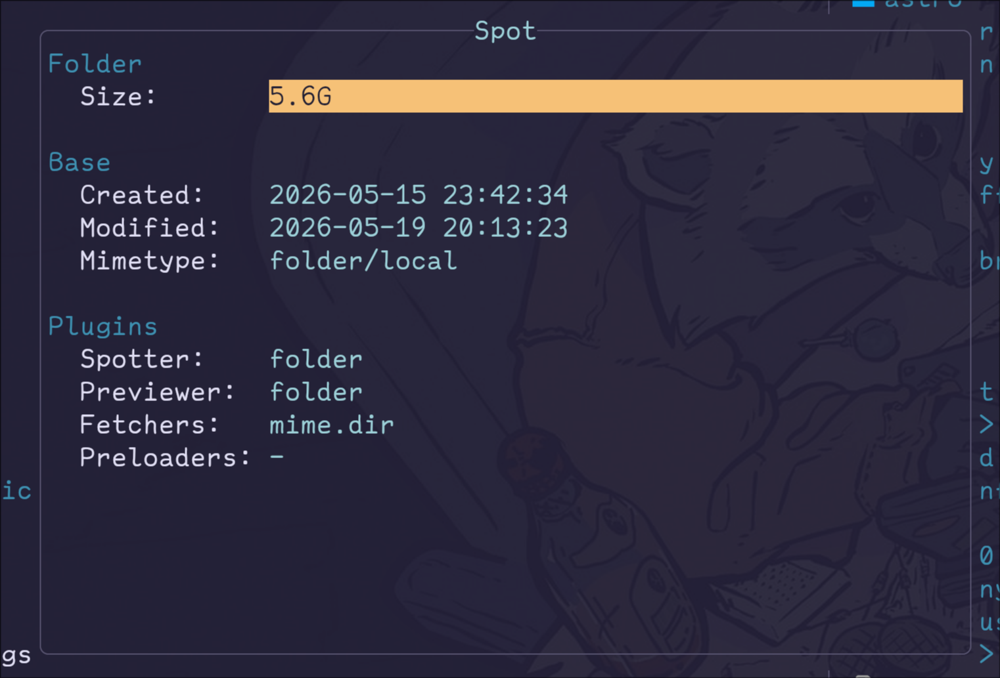

あと拡張機能もあるらしいが面倒そうなのでわたしは使ってない。

また、設定ファイルでデフォルトのソート方法などを固定できる。

```toml: ~/.config/yazi/yazi.toml
[mgr]
sort_by = "mtime"
show_hidden = true
show_symlink = true
sort_reverse = true
enter = "enter"

[[manager.prepend_rules]]
name = ".git/"
use = false
```

## Editor: Neovim

[Vim](https://github.com/vim/vim), [Neovim](https://github.com/neovim/neovim)

言わずと知れたVim, Neovim。ターミナル上で動作するエディター。ここで説明するには長くなりすぎるのでほかに譲りますが、とても便利なのでぜひ試してもらいたい。

一応私のneovimの設定ファイルたちも置いておきます。割とシンプルにしてます。[dotfiles-neovim](https://github.com/Uliboooo/dotfiles/tree/main/.config/nvim)


## Git Client: Lazygit

[Github-Lazygit](https://github.com/jesseduffield/lazygit)

Go製のTUI Gitクライアント。

個人的には超高級`git status`として使ってます。`git add .`の解除とか特定ファイルのstaging, unstaging, コミットメッセージの記述, 簡単なdiffなどはこれでやってます。あとはブランチへのSwitchなど。

ただmergeなどはちょっと怖くてCLiからやることもあります。

ワンクリックでできることは割と`lagygit`でやって、from toなどを明示したい時はCLIみたいな感じかも。

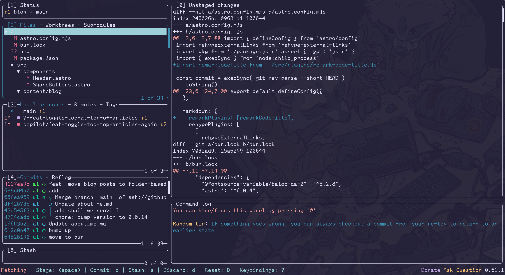

あとは、私が割とgit関連でalice(abbr)を貼ってるからそれで済むことも多いのかも。以下の`gls`とかずっと使ってる。

```zsh: ~/.config/zsh-abbr/user-abbreviations
abbr gst="git status"
abbr gda="git --no-pager diff"
abbr gln="git log --all --date-order --date=format:'%y-%m-%d %H:%M' --graph --format=' <%h> %ad [%an] %C(green)%d%Creset %s'"
abbr gla="git --no-pager log --all --date-order --date=format:'%y-%m-%d %H:%M' --graph --format=' <%h> %ad [%an] %C(green)%d%Creset %s'"
abbr gls="git --no-pager log --all --date-order --date=format:'%y-%m-%d %H:%M' --graph --format=' <%h> %ad [%an] %C(green)%d%Creset %s' -n 15"
abbr gf="git fetch"
abbr ghp="echo 'restora only a portion of the data.'"
abbr gbs="git switch"
abbr gbc="git switch -c"
abbr gb="git branch"
```

## System Monitor: Btop

[Github-btop](https://github.com/aristocratos/btop)

個人的にはそこまで頻繁に使っているわけではないですが何かと便利なのと画面が動いて好きなのでご紹介。

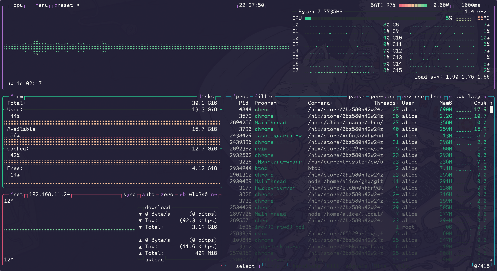

## オーディオセレクター?: wiremix

[Github-wiremix](https://github.com/tsowell/wiremix)

pavucontrolのTUI版的なやつ。

Linuxのpipewireなどを使ってる時の出力先の変更とか。音量操作はキーボードで十分なんですが、Bluetoothのヘッドホン使ってるときに一瞬スピーカー使いたい時とかに便利です。

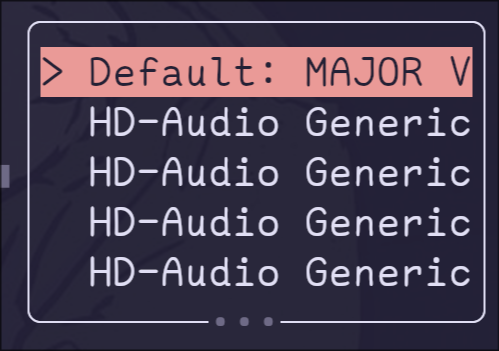

## Bluetoothマネージャー: bluetui

[Github-bluetui](https://github.com/pythops/bluetui)

Bluetoothの接続やペアリングなどをTUIでできるラッパー的な。たまに使う程度なのでCLIを覚えるのは嫌。

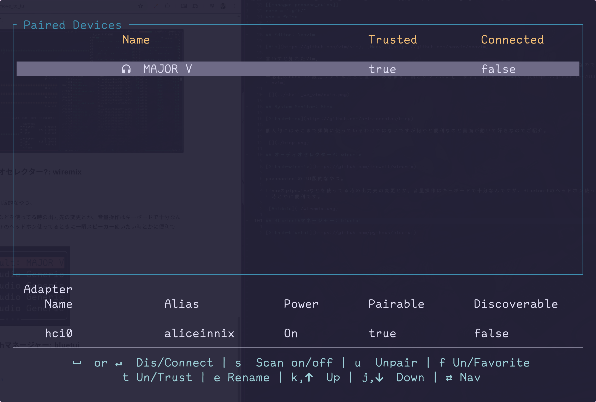

## Network manager: nmtui

[ArchLinix wiki - NetworkManager](https://wiki.archlinux.jp/index.php/NetworkManager)

NetworkManagerに付属するTUIのマネージャー。ここまでに紹介したツールよりモダンな感じはしませんが(もっさりしてるしリサイズに弱い)、まあ普通に使えるのでありです。

あと背景が透過されているという状態を考えていないのか、透過されたターミナルで開くと可読性が地獄になります。(シャドウぽいのが描画されてる時点で割と察せる部分もありますが)

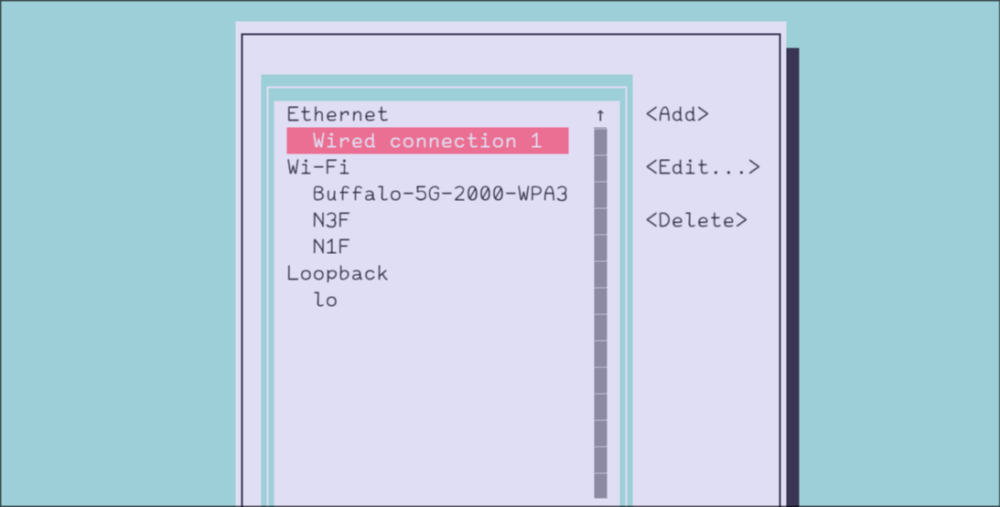

## ファイル検索: fzf

[Github-fzf](https://github.com/junegunn/fzf)

TUIというかCLIというかって感じですが、対象をファジー検索できるツール。

`fzf`単体で使うというよりは選択したい対象のリストを`fzf`に与えて、`fzf`内で選択して返ってきたもの(=選択したもの)を使う感じ。neovimのファイル検索系のプラグインでも多用されている。

例えば
```zsh: ~/.zshrc
function g() {
  cd "$(ghq root)/$(ghq list | fzf --preview 'ls $(ghq root)/{}')"
}
```

ghqというgit repoを管理するツールがあり、それらの管理下のリストからrepoを選択して、フルパスを生成(ghqのroot + 選択repo)。  
=> それを$()内で行い、cdすることでファジーにrepoを検索, 移動できるようになる。

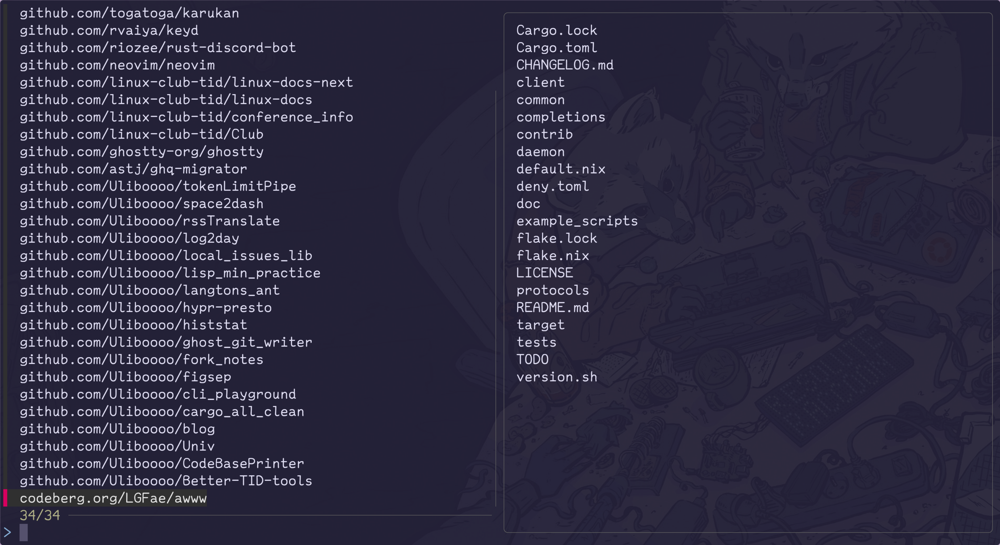

## なぜTUIにするのか

まず、キーボード操作がメインになっていることがほとんどのため、マウスをぽちぽちする回数が減ります。ならCLIでもいいじゃないかとも思いますが、CLIはオプションなどについて初見では使いにくく、学習コストが高いです。しかしTUIならそれなりにプレビューや操作ヘルプもインタラクティブに出ることが多く、学習コストが低い(学習曲線がゆるやか)です。

また、私はマウス廃止論者ではないので、全然TUIでもマウスを使います。どっちも使えた方がいいに決まっています。ただGUIよりはキーボードによる操作へのアクセスが標準的な設計であることが多いためTUIを推しています。

第2に、統一感があります。

現在、私はHyprlandを中心にLinux デスクトップを使っていますが、GNOMEやKDEのように標準提供のGUIアプリケーションがありません。そのため他所から色々なツールを使いますのが日常なのですが、GUIアプリケーションはデザイン面でも操作面でも統一されていないことが多いです。(特にLinuxに関しては)

GNOME系(GTK)やKDE(Qt)などである程度の統一感はあれど、操作感は異なるし、使いたいツールが全てGNOME系に寄っているかと言われれば異なります。最近はelectronなども増えましたし。

しかし、TUIは基本的にターミナルでの動作である以上、デザインのカスタマイズには限界がありますし、やれるUIにも制約が大きいです。また色合いなどの雰囲気もターミナルによる影響を受けやすいため、ツール間での統一感を向上させることができます。

また、Vimキーバインドという多くのTUIで採用されている操作方法があり、ツール間での操作ギャップも減らすことができます。

## おまけ: Hyprlnad + waybarでの起動

以下は私のwaybarの一部です。CPU温度やネットワークなどのステータスを上部のバーに表示しているのですが、先程の一部のTUIはここからクリックで起動できるようになっています。


そしてHyprland専用に近いのですが、フロート状態で起動することで臨時的に詳細なステータスなどを見ることができます。

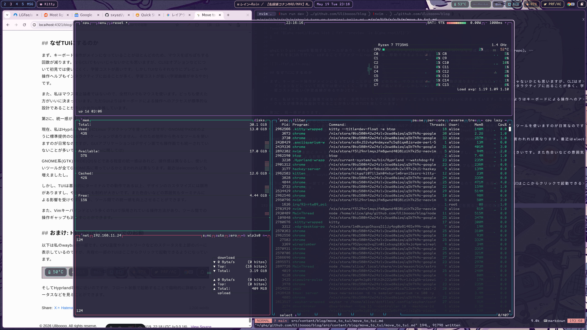

Hyprlandは起動したウィンドウの`class`や`title`によってウィンドウルールを適用することができるので、waybarからの起動時に`class`を指定することでwaybarから起動された時だけ`btop`を`flaot` + `center`で起動するなどができます。

```lua: ~/.config/hypr/config/window_rules.lua
hl.window_rule({
  name = "dev-float-by-class",
  match = {
    class = "^(dev-float)$",
  },
  size = { "(monitor_w*0.75)", "(monitor_h*0.9)" },
  float = true,
  center = true,
})
```

---

古いhyprland(luaじゃないバージョン)なら以下
```conf: ~/.config/hypr/hyprland.conf
windowrule = match:class ^(dev-float)$, float true
windowrule = match:class ^(dev-float)$, center true
windowrule = match:class ^(dev-float)$, size 1200 900
```

---

これらの設定が適用されたhyprlandにおいて以下のようなwaybarの設定を用いるとwaybar起動なbtopだけfloatにできます。

```jsonc: ~/.config/waybar/config.hypr.jsonc
"temperature": {
    "critical-threshold": 80,
    "format-critical": "{icon} {temperatureC}°C",
    "format": "{icon} {temperatureC}°C",
    "format-icons": [""], # nerdフォントが映らない
    "interval": 10,
    "on-click": "kitty --title='dev-float' -e btop"
},
```

---

終わり。最後までありがとうございました。

