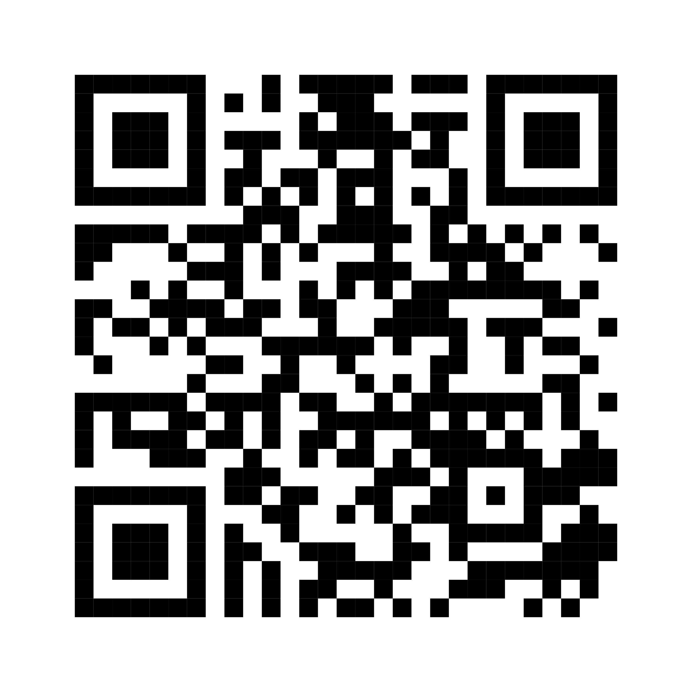

https://github.com/fukuchi/libqrencode

~~ほとんどhelpの日本語訳...~~

## 基本

```bash
qrencode -o save/to/file "URL"
```

## エラー耐性

`-l`オプションにL(owest)からM, Q, H(ighest)まで4段階のオプションがあり、デフォルトとはL。

```bash
qrencode -o save/to/file -l H "URL"
```

## 1マス(ブロック)のサイズ

`-s number`で1マスの大きさをpx単位で変更できる。

```bash
qrencode -o save/to/file -s 10 "URL"
```

## 拡張子

`-t`に`{PNG,PNG32,EPS,SVG,XPM,ANSI,ANSI256,ASCII,ASCIIi,UTF8,UTF8i,ANSIUTF8,ANSIUTF8i,ANSI256UTF8}`のいずれかの値を設定して変えることができる。`-o`のファイル名の拡張子との競合や優先度は不明。~~調べるの面倒~~

```bash
qrencode -t SVG -o save/to/pash.svg "URL"
```

## 実例

```bash
qrencode -s 50 -o about_me.svg -t SVG "https://blog.uliboooo.dev/blog/about_me/"
```

上記のコマンドによりSVGとして生成されたQRコード(実際はpngに変換済みですが)をフォントサイズ11のターミナル上で表示されたQRコードです。



QRコードのはその用途的にも拡大をする可能性も高いため、SVGで書き出すのが安全だと思います。

ちなみにQRの内容は私の紹介ページです。
