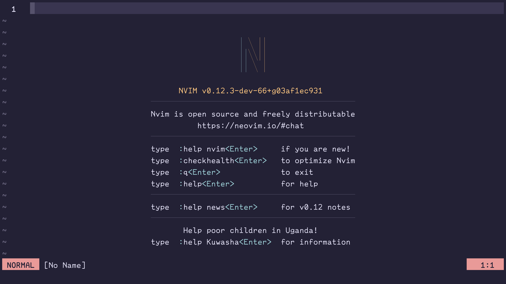

---
title: "Shall We Vim?"
date: 2026-05-15
writer: "Uliboooo"
description: "vim URLs"
tags: ["vim", "editor"]
published: true
---

## What's Vim?

=> Text Editor.

自由で高速で効率的なエディター。

## Vim or Neovim?

VimはViをImporovedしたもの。NeovimはVimのNeoしたもの。

[Vim](https://www.vim.org/), [neovim](https://neovim.io/)

どちらもモーダル編集を持ったエディター。多くはTerminal上で動作するがGUIクライアントも存在する。

Neovimは非同期のサポートやluaでの設定ファイルサポートなど色々モダン。実はまだ0.x.y。
