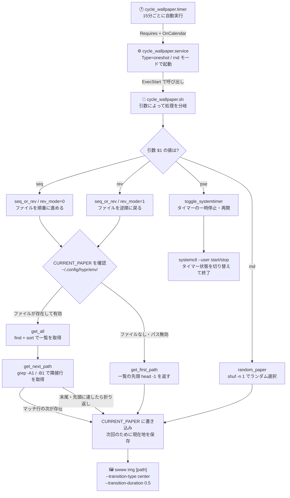

## 環境

```bash
OS: Arch Linux x86_64
WM: Hyprland 0.54.2 (Wayland)
Kernel: Linux 6.19.9-arch1-1

Wallpaper_Manager: swww
Daemon_Manager: systemd
```

## 仕様

仕様というほどじゃないですが、動作に関する概要を。

- 指定のフォルダ内の画像を順`seq`,逆`rev`,ランダム`rnd`の順で背景に設定する
- user systemdを使って15分毎に自動切り替え

もっと具体的な仕組みについては以下のリストとフローチャートを。

- 壁紙の操作は`cycle_wallpapaer.sh`内で`swww`コマンドを用いる
- スクリプトはモードとして順`seq`,逆`rev`,ランダム`rnd`,スライドのポーズ`pse`の4つ
    - `pse`はsystemdのstart, stopをトグルする
- 15分(:00,15,30,45分)ごとにランダムで切り替わるようにuser systemdでスクリプトを叩く
- 現在の壁紙のパスは`$HOME/dotfiles/.config/hypr/env/CURRENT_PAPER`にテキストとして保持



ちなみにhyprlandの設定で以下のようにして手動でも操作できるようにしてます。

```toml: ~/.config/hypr/hyprland.conf
# wallpapers
bind = $mainMod, W, exec, ~/dotfiles/script/cycle_wallpaper.sh "seq"
bind = $mainMod SHIFT, W, exec, ~/dotfiles/script/cycle_wallpaper.sh "rev"
bind = CONTROL ALT, W, exec, ~/dotfiles/script/cycle_wallpaper.sh "rnd"
bind = $mainMod CTRL, W, exec, ~/dotfiles/script/cycle_wallpaper.sh "pse"
```

## ソースコード

https://github.com/Uliboooo/dotfiles/blob/main/script/cycle_wallpaper.sh
https://github.com/Uliboooo/dotfiles/blob/main/.config/systemd/user/cycle_wallpaper.service
https://github.com/Uliboooo/dotfiles/blob/main/.config/systemd/user/cycle_wallpaper.timer
