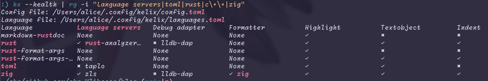

## Helixとの出会い

ここ数ヶ月、vimやらneovimやらhelixを触ってきた。helixはpluginシステムはなく[^1]基本的に拡張性は`config.toml`, `languages.toml`程度。vim, neovimと異なるのはその多くのモダン機能をbuilt-inにしてzero-configを目指したエディタということであり、以下の引用の通り、強い拡張の必要性を無くそうという思想。

> Helix is a pragmatic editor: it should behave as you'd expect out of the box,  
> Helixは実用的なエディタです。導入したそのままで期待通りに動作すべきであり、  
[あるIssueの一部より](https://github.com/helix-editor/helix/discussions/3806#discussioncomment-6686976)

この思想によってlspもtree-sitterもformatterも自動で設定される。`--health`オプションで現在どのlspなどが使えるかがわかるので`grep`や`rg`で確認してみるといいかもしれない。



この設計が便利なのは`nix develop`でも`dnf install`でもいいのだけれど、そのPATH上に必要なツールがあればhelixは自動でそれを使う。つまり書きたい言語が増えるたびに`vim.lsp.enable("lang-name")`をlsp.luaに追記するする手間がいらないということ。

確かにhelixが対応してないと`lauguages.toml`をこねくり回す必要があるけれど、メジャーどころはほとんど対応しているので特に問題はない。雑な計測で申し訳ないけれど大体300言語(正確性は相当欠けるけども)対応している。少なくともその言語のlspが普通にある言語なら大丈夫なのでは。

```bash
:) hx --health | wc -l
     310
```

Neovimのdotfiles盆栽に飽きていた私には衝撃とまでは言わないまでもそれなりに感動した。しかししばらく使えばそれなりの欠点も見えてくる。

## Vimではない

当然だけれどHelixはVimではない。どちらかといえば[Kakoune](https://kakoune.org/)というエディターからの派生に近いらしく、VimぽさはありつつもVimではない。

決定的なのが操作の順であり、Vimで単語を消すなら`diw`あたりが妥当だろう。(あとは`dw`?)しかしhelixは`wd`。Vimが"delete inner word"ならhelixは"word delete"である。なんならhelixの場合デフォルトでwordくらいの選択はされていることが多いのでいきなり`d`で単語削除はできる。

要は文法が逆であって、vimはdeleteやchangeなどのoperator + motionという文法なのだけど、helixはmotion + operator。常にVimのVisual modeを使っているようなもの。

最初はVimを使い始めたばかりだったこともあって、すぐに慣れるだろうとも思っていたけれど、私は思った以上にVimに指が慣れてしまっていた。そうでなくともまだhelixができないことも多い。

- 日本語文の適切なSemantic parse
- 矩形モード的な(マルチカーソルはあるけど)
- **行末の**white spacesのみ`·`表示とか
-

ただhe

## VS CodeやZedは?

[^1]: [Plugin system #3806](https://github.com/helix-editor/helix/discussions/3806)
にもあるようにまあ~~クソ~~長い議論は合ったようで、ただ個人的にもHelixとpluginっていうのはあんまり相性がいいとも思わない。というかhackerたちはpluginがあれば拡張性への欲望を抑えられないので。
