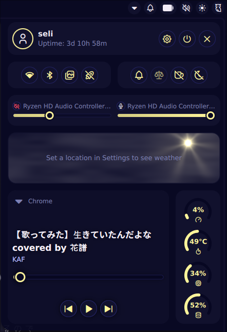
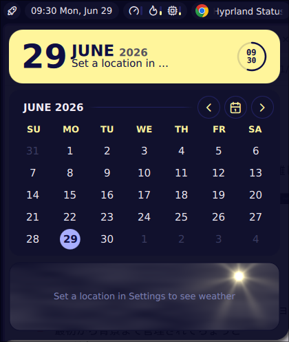
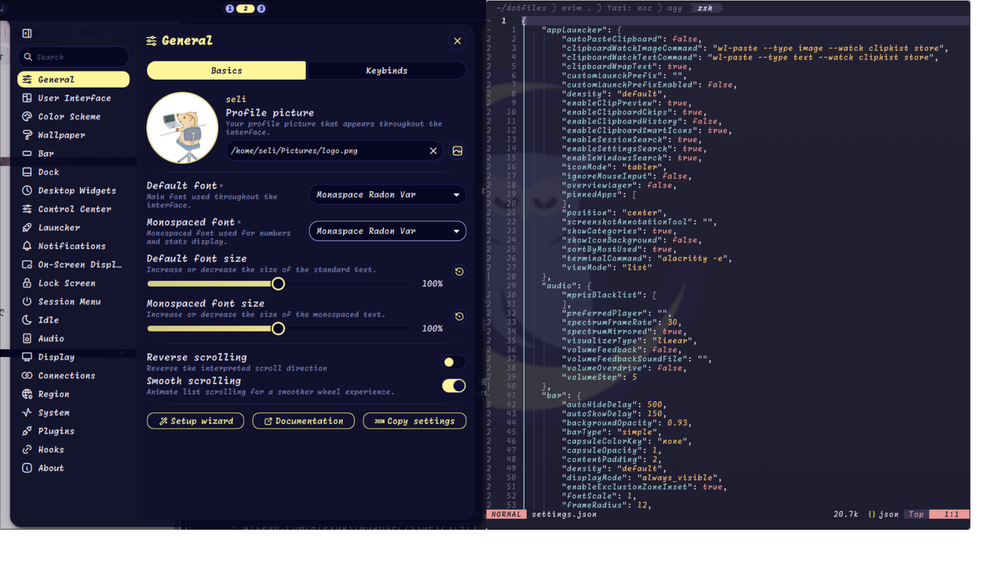

hlはhyprlandの略です。

## waybar

設定ファイル: `jsonc`, `css`

一番長く使ってる。文字ベース。

:::pros
- 設定がjsonとcssでシンプル
- nerd fontsなども合わせて文字ベースで楽
:::

:::cons
- アニメーションは弱い
- hl上でworkspacesがボタンクリックで移動できない[^1]
:::

[GitHub](https://github.com/alexays/waybar), [My waybar config👇](https://github.com/Uliboooo/dotfiles/tree/main/.config/waybar)

## Ashell

設定ファイル: `toml`

ちょっと触っただけ

:::pros
- 設定なしでもそこそこのUIができる
- GNOMEぽさ シンプル
:::

:::cons
- islandの角の丸を調整できない
- 好きなデザインがあるとそれに合わせるのは難しそう
:::

## Noctalia

設定ファイル: `json`

初めてのhlないしwaylandのstatus barとしてはとてもいい。完成度高く設定も難しくない。
ashellに手軽がカスタム性がついた感じ。

:::pros
- 最初からいい感じのデザイン(色もアニメーションも)
- 必要なものが全部揃ってる
  - launcherから通知センターまでなんでも
- GUIのconfigがある
- フクロウかわいい
- アイコンなども画像が使えるらしくモダン
:::

:::cons
- 最初から背景まで管理されてちょっとうざい
  - 普段はawwwとそれを使ったスクリプトで制御しているので
  - 多分Status barってよりはwayland widgetな感じ
- 良くも悪くも全体管理なので(デフォルトは), 各種ツールを組み合わせてごちゃごちゃやりたい人は苦手そう
  - まあいらないものはoffにすればいい
- パッと見の印象としては`config.json`をで設定を書く感じではない(GUI中心)
- アイコンの画像化はいいけど、個人的にはnerd fonts使って雰囲気を合わせることができるwaybarの方が好きだったり
:::

:::image-row

:::

## まとめ?

個人的にnerd fontsのアイコンも好きなのでwaybarいいけれど、設定を凝りたくない場合はnoctaliaが良い選択かも。しばらくnoctalia生活してみます。

[^1]: hlのv0.55あたりの破壊的変更についていけてないとかなんとか。[参考issue](https://github.com/Alexays/Waybar/issues/5147)

