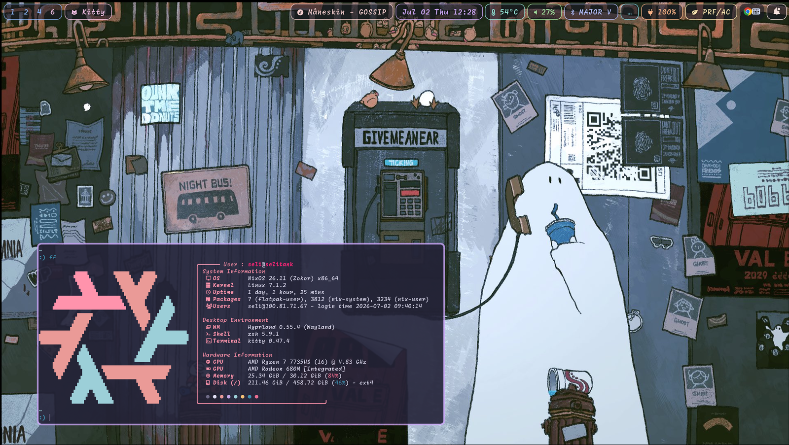
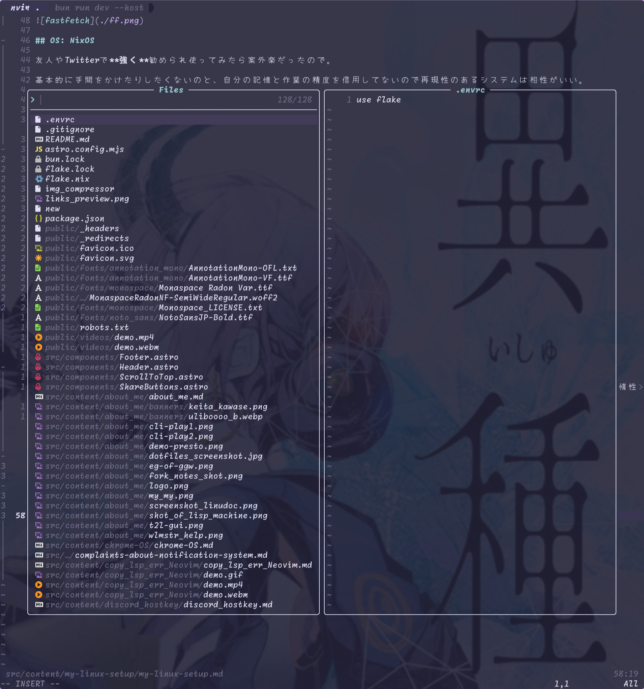
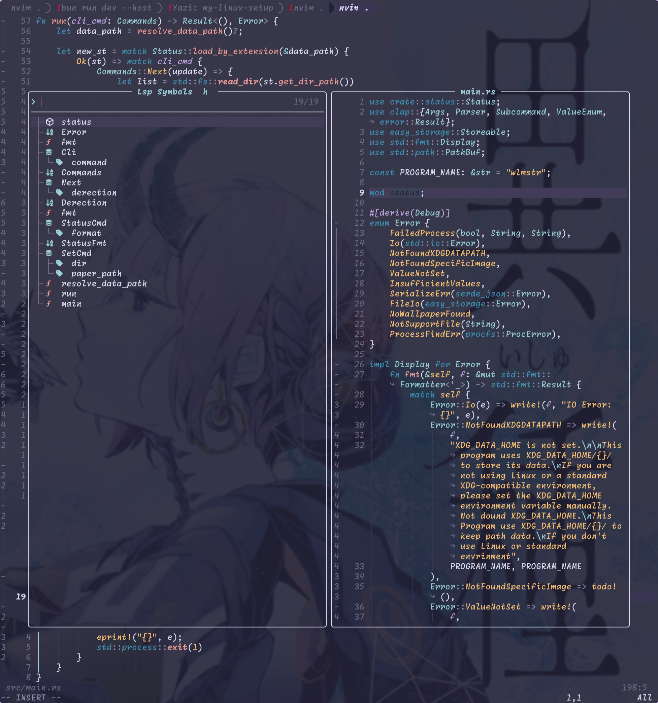
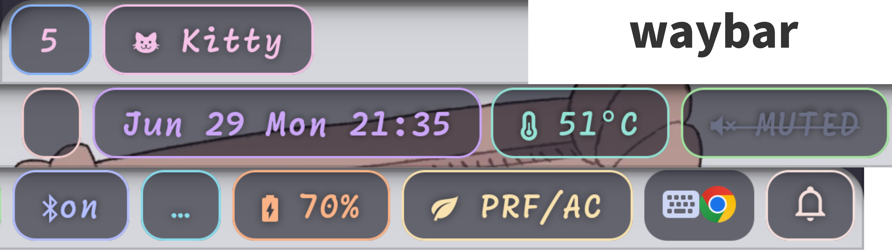
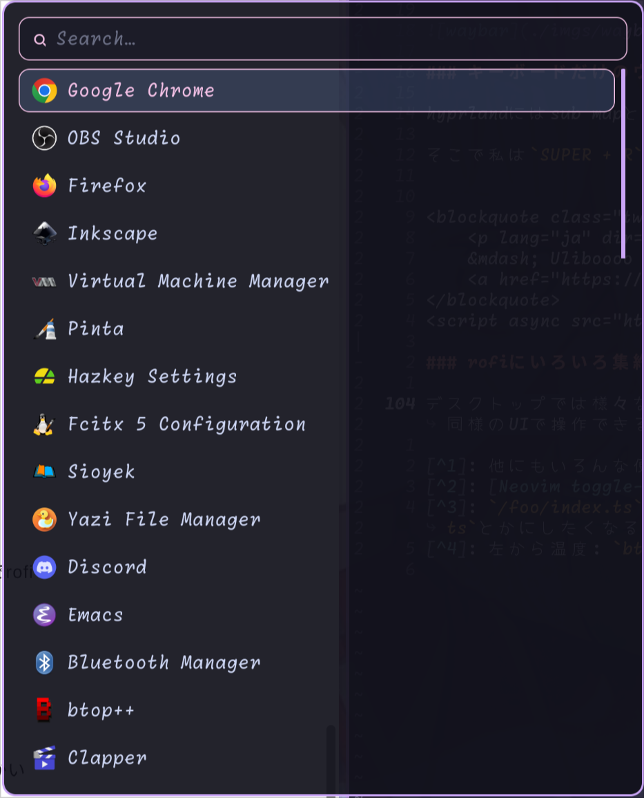
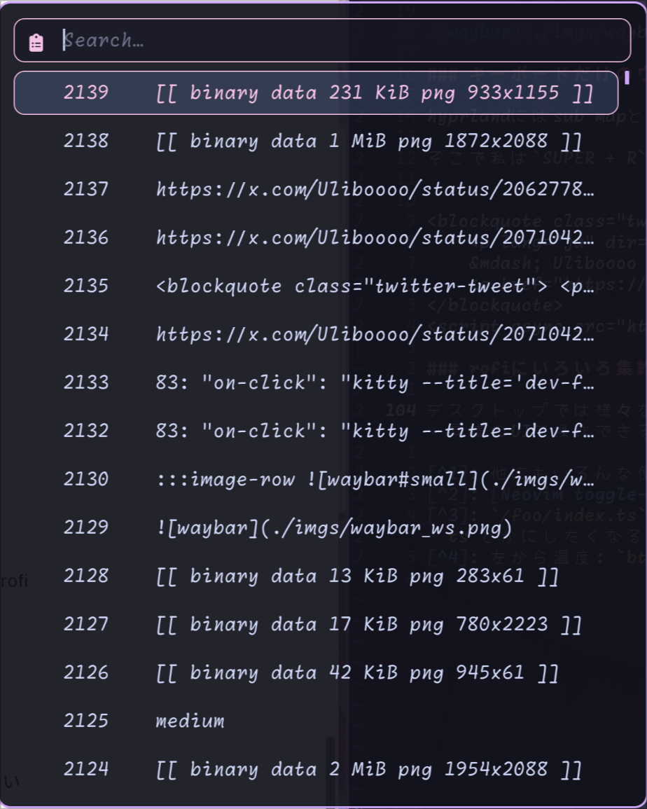
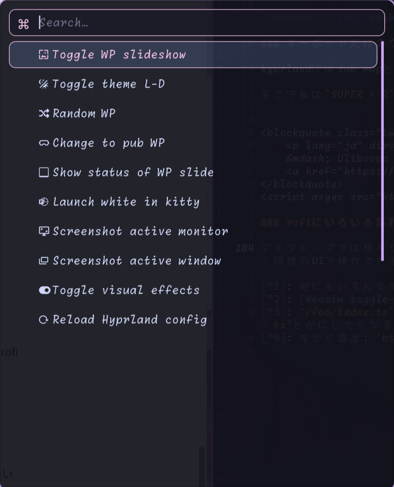
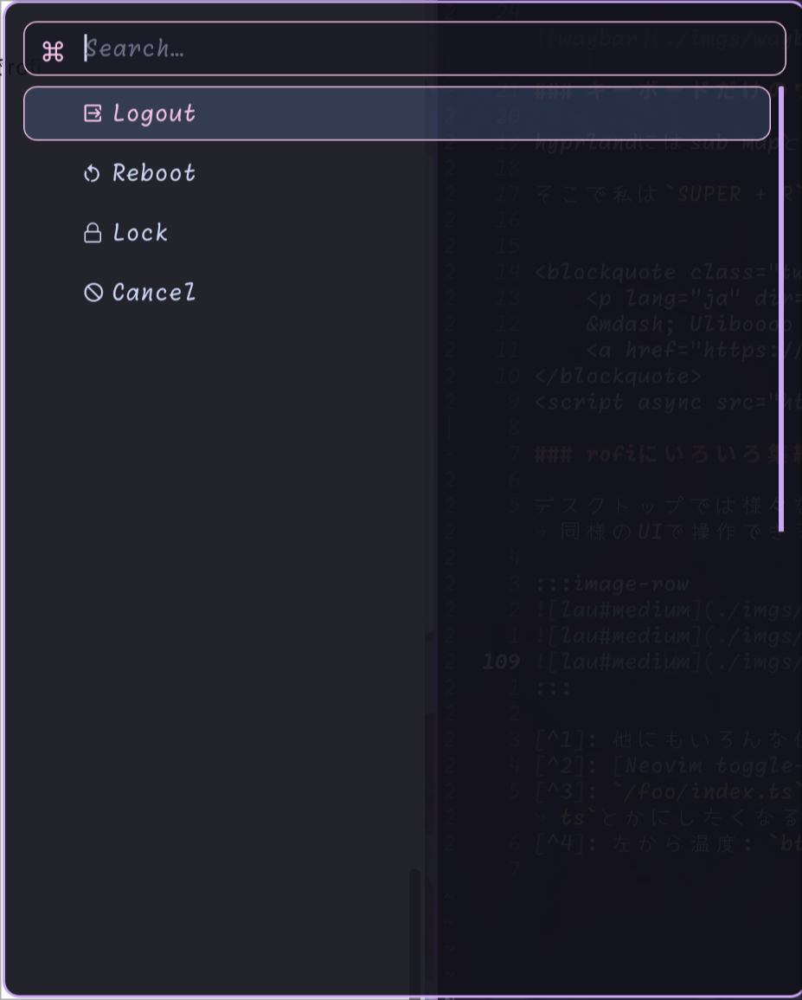

## OS: NixOS

友人やTwitterで**強く**勧められ使ってみたら案外楽だったので。

基本的に手間をかけたりしたくないのと、自分の記憶と作業の精度を信用してないので再現性のあるシステムは相性がいい。

Archなどのようなハックして云々するよりは、計算機として抽象化されたものを使える感?がいいです。

設定はだいたい以下の構成で、NixOS(+ homemanager), Linux + Standalone nix, or macOS(nix)といった感じ。最近はmacOSのサポートをサボっているので、rebuildに失敗する。

```bash
dotfiles
├──  flake.lock
├──  flake.nix
├── 󱂵 home
│   ├──  alice.nix # mac向け
│   ├──  common_user.nix # どっちも
│   └──  seli.nix  # linux向け
├──  hosts
│   └──  desktop
│       ├──  configuration.nix
│       └──  hardware-configuration.nix
└──  modules
    ├──  common.nix
    ├──  desktop.nix
    └──  thinkpad.nix
```

正直nixの記述面でのコストは全てAIで踏み倒したため、私はほぼnixという言語は書けない。

まあ使えてるので良し。

## エディタ: Neovim(lazy.nvim)

1年弱前くらいから始めた。理由はカッコいいから。普通に慣れれば楽でvimがないエディタが嫌いになるくらいには馴染んだ。ただ惰性で使っているのでマクロとかよくわからないし、未だにpluginを作れる気はしない。

vscode -> nvim -> helix -> nvimといった感じで、一瞬helixを使ってやっぱりvimが欲しくなり戻ってきた。

このhelix -> nvimの過程でいくつかnvimに逆輸入した機能があり、

- `<Leader>`をSpace barに
    - :+ Ctrlより親指で押しやすい位置にある
    - :- 通常の入力とprefixとの判定で詰まることがある[^2]
- ファイラーをfzfなpickerに
    - 基本的には[snacks.nvim](https://github.com/folke/snacks.nvim)を使ってる[^1]
    - :+ 1発でファイルを開ける
    - :- ツリー構造は見にくい(`/foo/index.ts`とかが苦手になる[^3])

左がfzfなfile picker, 右がlspの一覧。どちらの似たUIで操作できるのでスイッチコストが低め。lsp経由のcode actionsなども似たUIなので楽。

:::image-row


:::

## Window Manager: Hyprland

みんな大好きなHyprlandです。選定理由としては

- 周りのツールが揃ってる(hyprlidle, lock, shot, etc...)
- 雑に強めの効果をつけれる
- auto-tilingで頭空っぽにして操作できる
- rofiなどと組み合わせれば自分の使いやすい環境に簡単にできる

くらいです。

個人的に好きなカスタムをいくつか

### waybar

ぶっちゃけ書いたのはほぼAIですが、好みに仕上げてます。waybarは文字ベースなのでアイコンはnerd fontsのiconを使ってます。kittyかわいいね。イメージはネオン管。

これはBarで細長くてスクショに入らないので切って並べてますが、上からleft, center(正確には温度計以降がright), rightになってます。特にrightのシステム系はそれぞれhyprlandのfloating windowでkittyを起動して適切なTUIが動くようになってます。[^4]



### キーボードだけのウィンドウ リサイズ

hyprlandにはsub mapというものがあり、特定のモードによってキーバインドを変更出来ます。

そこで私は`SUPER + R`でresizeモードに入り、`hjkl`でウィンドウをリサイズできるようにしています。


<blockquote class="twitter-tweet">
    <p lang="ja" dir="ltr"></p>
    &mdash; Uliboooo (@Uliboooo)
    <a href="https://x.com/Uliboooo/status/2071042133914755396?s=20"></a>
</blockquote>
<script async src="https://platform.twitter.com/widgets.js" charset="utf-8"></script>

### rofiにいろいろ集約

デスクトップでは様々なものを選択しますが、それぞれが別のUIでは面倒です。そこでrofiの`dmenu`モードを使って色んなことを同様のUIで操作できるようにしています。

左上からapp launcher, clipboard history, コマンドパレット, 即時lockとかlogoutとか。パレットはキーバインドにするほどじゃないやつとか。

:::image-row




:::

## ターミナル: kitty

特別に理由もないですが、nix手入れやすい & linuxで使いやすいを求めると自然にこうなった感じ。tab機能くらいしか使ってない。強いて言うなら独自のプロトコルでエスケープシーケンスで文字サイズを同一バッファー内で変更できるので、`presenterm`などとの相性が良いというのもある。

## Shell: Zsh

bash互換強めでabbrが使えるとなると割と妥協点。対話だけならfishもいいけど、たまに互換性とかで面倒になるので結局zshに。

## ハード: ThinkPad

特にこだわりはない。USレイアウトのラップトップを国内で調達できるのがMacbookかThinkPadか、くらいか感じなので... (DELLもあったかな?) 強いて言うならもっと輝度が高くまででるマシンにすればよかったとは。窓が近いとつらい。300nitsがMAXなので。

[^1]: 他にもいろんな便利機能(statuscolumn, indent guides, etc...)があって便利。細かいpluginsを吸収してくれる
[^2]: [Neovim toggle-term内のスペースが重い](https://blog.uliboooo.dev/neovim-toggleterm-spc-lag/)
[^3]: `/foo/index.ts`じゃなくて`/foo/foo.ts`とかにしたくなるっていう。pickerでもディレクトリ命も検索対象だけどファイル名で絞れたほうが楽なので。
[^4]: 左から温度: `btop`, 音量: `wiremix`, BT: `bluetui`, Net: `nmtui`が起動する。

