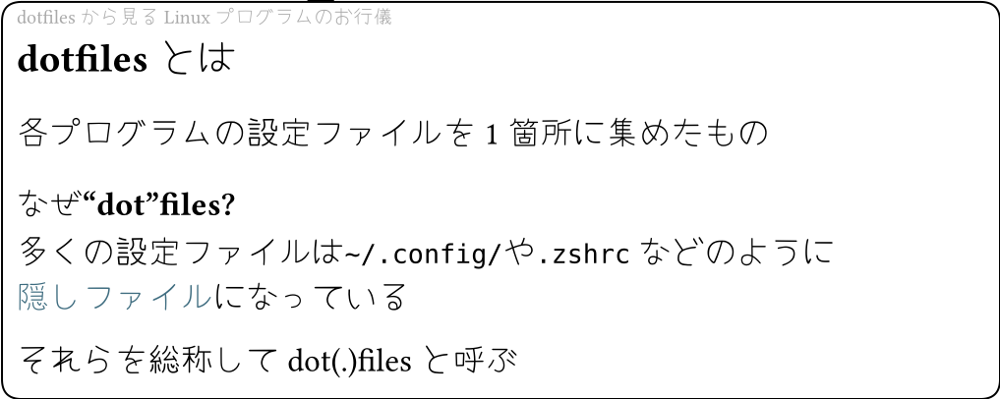
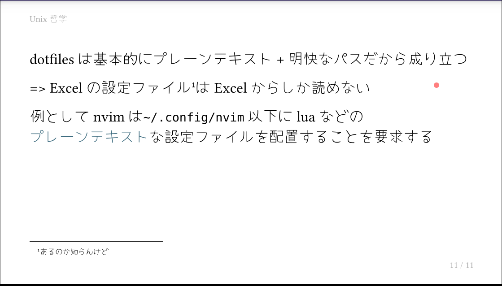
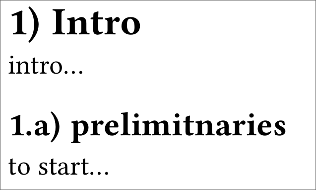

メモしていく。

ちゃんとした話は[こちら](https://typst.app/docs/reference/syntax/).

## Strong emphasis (bold)

```typst
*strong*
```

## Emphasis (italic)

```typst
_emphasis_
```


## 日本語で単語中の改行を禁止

`#box[]`で囲む

```typst
=== なぜ"dot"files?

多くの設定ファイルは`~/.config/`や`.zshrc`などのように#box[*隠しファイル*]になっている

それらを総称してdot(.)filesと呼ぶ
```

この例では"隠しファイル"がboxになるため単語中で改行されない。



## footnotes

```typst
this is an apple.#footnotes[but it is may poison apple.]
```

番号付けを自分でやらなくよくて便利。`touying`[^1]なども対応しているので便利(👇)。





## heading

typst的にはheading lebel 1はhtmlの`h1`とは違い、文書セクタの最上位というだけなので文書中に1つの存在である必要はないそう。

html exportの際は`=`(level 1)が`h2`に、`==`(level 2)が`h3`になるそう。[^2]

```typst
= Heading 1
```

`#set heading()`でいろいろ設定できるよう

```typst
#set heading(numbering: "1.a)")

= Intro

intro...

== prelimitnaries
to start...
```

これがこうなる



[^1]: typstでslideぽいPDFを生成するやつ[Getting Stated](https://touying-typ.github.io/docs/start?utm_source=chatgpt.com)
[^2]: [typst\.app](https://typst.app/docs/reference/model/heading/)
